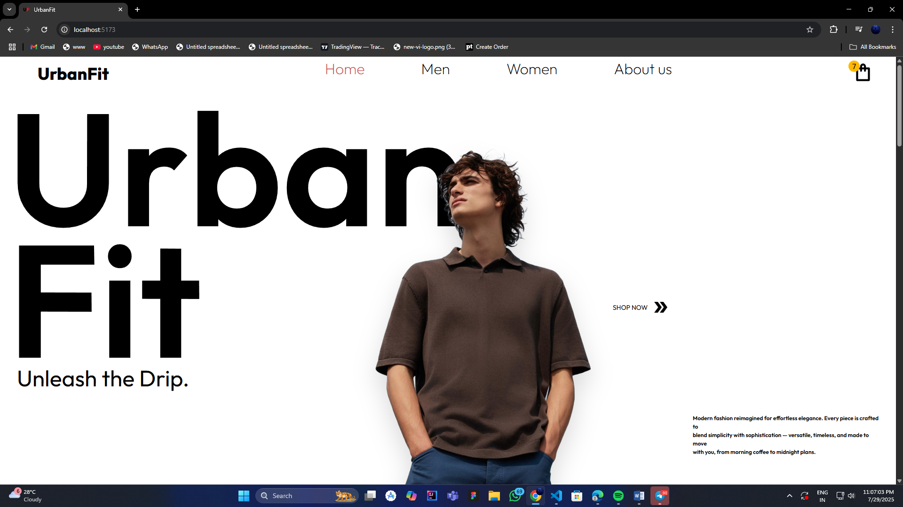

A sleek, modern, and fully responsive fashion e-commerce website built with **React.js**, **Tailwind CSS**, and **GSAP**. Designed to mimic real-world shopping platforms with advanced features like filtering, cart system, smooth animations, and reusable architecture.

## 🌐 Live Demo
**Website:** [https://urbanfit-demo.vercel.app](https://urban-fit-eight.vercel.app/)

## 📁 GitHub Repo
**Repo:** [https://github.com/your-username/urbanfit](https://github.com/TechDiverArajit/UrbanFit.git)

---

## 🚀 Features

- ⚛️ **React.js** based SPA
- 💅 **Tailwind CSS** for fully responsive design
- 🛒 **Add to Cart** with quantity, size, subtotal & item management
- 🧠 **useContext + useReducer** for global cart state
- 🧭 **React Router** for client-side routing
- 🎨 **Advanced Filters** (by Brand & Color)
- 📦 **Dynamic Product Pages** with size selection, reviews, and more
- 💖 **Add to Favorites (Wishlist)** functionality
- 💫 **GSAP** animations for a smooth UI experience
- 📱 Mobile-friendly & clean UI
